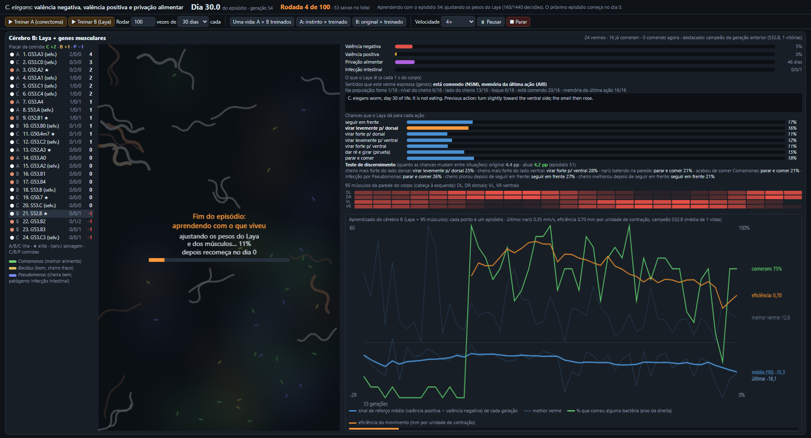
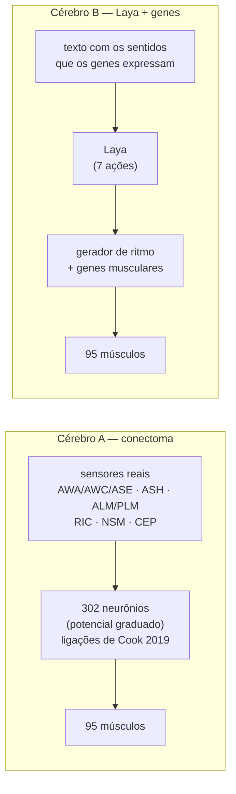
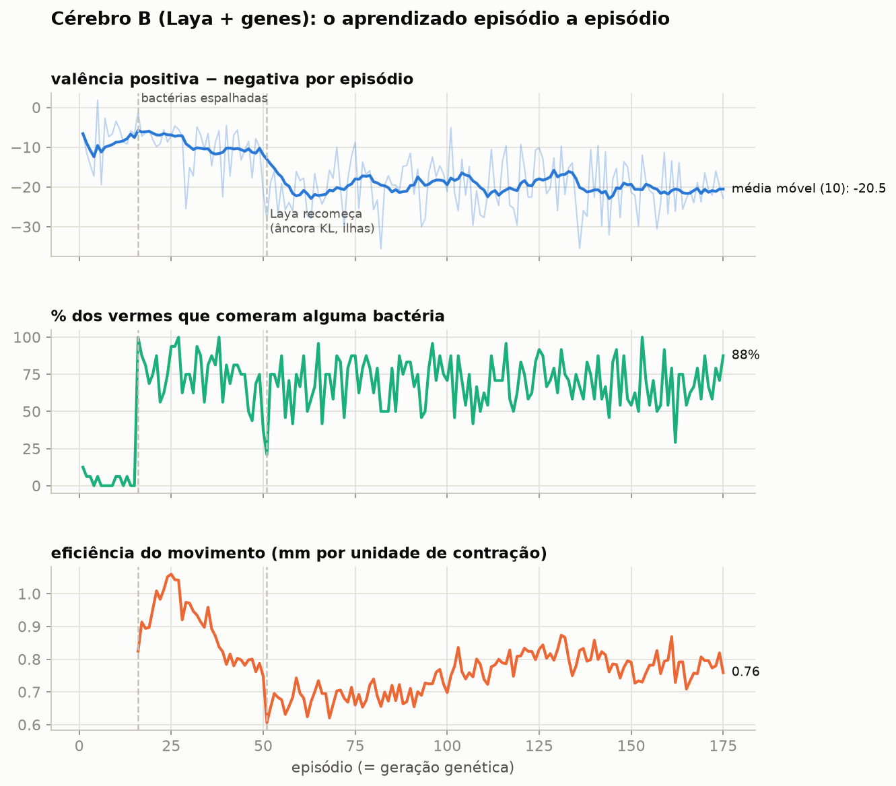
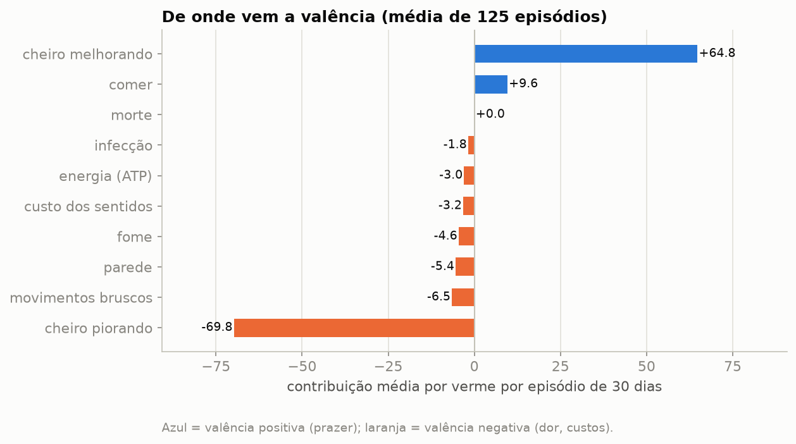
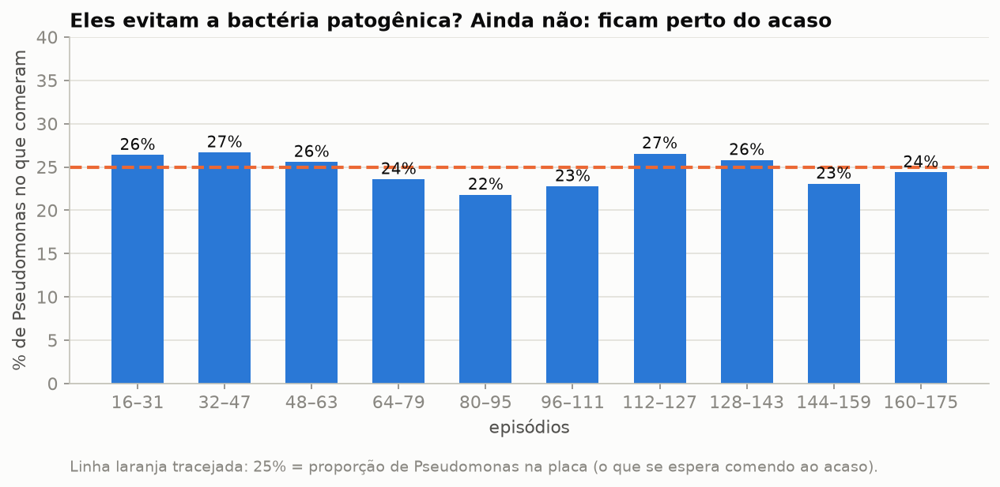
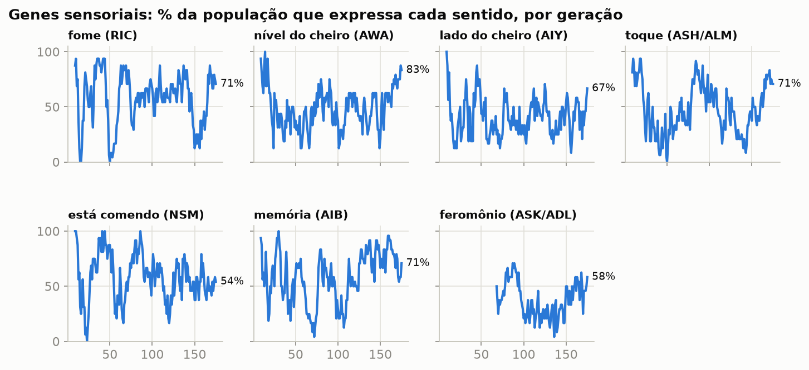

# *C. elegans*: valência negativa, valência positiva e privação alimentar

Uma simulação do nematoide ***Caenorhabditis elegans*** em que o verme aprende a sobreviver guiado pelos impulsos
mais primitivos — **dor** (valência negativa), **prazer** (valência positiva) e **fome** (privação alimentar) — com o
treino acontecendo **ao vivo na tela**. Dois cérebros são comparados:

- **Cérebro A — o conectoma real:** os **302 neurônios** e **95 músculos** do verme, com as ligações medidas por
  Cook et al. (2019), ajustados por estratégias evolutivas.
- **Cérebro B — Laya + genes:** uma IA de decisão (Laya) lê em texto o que o verme sente e escolhe a ação; um
  **algoritmo genético** evolui os músculos e os sentidos de uma população de 24 vermes.



*À esquerda, o placar da comida (Comamonas +2, Bacillus +1, Pseudomonas −1) com a ilha e a tribo de cada verme; no
centro, a placa com as bactérias e os 24 vermes (cor = tribo, ★ = elite, branco = selvagem); à direita, o que o Laya
lê, as chances que ele dá a cada ação, o teste de discernimento, os 95 músculos e o gráfico do aprendizado.*

---

## O mundo

| | |
|---|---|
| **Corpo** | 1 mm, 24 segmentos (um por fileira de músculos); física de rastejar no ágar (*resistive force theory*: arrasto lateral 20× maior que o longitudinal). Uma onda de 0,5 Hz dá ~0,2 mm/s, como o verme real. |
| **Relógio** | 1 dia de vida = 2 s do corpo; 90 dias ≈ 3 min assistindo em 1×. |
| **Fome** | cresce **exponencialmente** com os dias sem comer; morte por inanição no dia 90 (plausível para a larva *dauer*, que aguenta meses). |
| **Comida** | 30–50 microcolônias que se movem devagar, somem ao ser comidas e renascem em outro lugar: ***Comamonas*** (melhor alimento), ***Bacillus*** (bom, cheiro fraco) e ***Pseudomonas*** (cheiro mais forte, mas **patógeno**: causa infecção intestinal). |
| **Valência positiva** | comer (vale mais com fome) e o cheiro ficar mais forte. |
| **Valência negativa** | bater na parede, o cheiro piorar, a fome, a infecção, gastar energia (ATP), manter sentidos, movimentos bruscos — e a **morte**, a maior de todas. |

## Os dois cérebros



**Cérebro A** (`simulacao/cerebro_conectoma.py`): cada neurônio é um integrador com potencial graduado; ACh e
glutamato excitam, GABA inibe; os motoneurônios B (frente) e A (ré) sentem a curvatura do corpo (propriocepção,
Wen et al. 2012). Aprende por **estratégias evolutivas** (OpenAI-ES) apenas nas sinapses sensoriais, interneurônios e
da cabeça — o circuito da marcha fica fixo, como o instinto do verme real.

**Cérebro B** (`simulacao/cerebro_laya.py`, `simulacao/treino.py`):

- **Decisão (aprendizado por reforço):** a cada segundo de vida, o Laya lê o texto de cada verme e escolhe entre
  7 ações — seguir em frente, virar **levemente** ou **forte** para cada lado, pirueta (ré + curva em ômega) e parar
  para comer. Treino REINFORCE com linha de base do grupo e uma **âncora KL** no Laya original (para não esquecer o
  que já sabia); só as 8 camadas de cima do codificador treinam.
- **Corpo (algoritmo genético):** cada verme tem **147 genes musculares** (frequência, força e curva de cada ação;
  ganho de cada um dos 95 músculos; tempo de cada trecho do corpo) e **7 genes sensoriais** liga/desliga — fome (RIC),
  nível do cheiro (AWA), lado do cheiro por espécie (AIY), toque (ASH/ALM), paladar (NSM), memória (AIB) e
  feromônio (ASK/ADL, lotação e escassez). Só os sentidos expressos entram no texto, e cada um custa energia.
- **Evolução em ilhas:** 24 vermes em 3 ilhas (2 elites + 5 filhos + 1 selvagem cada); cruzamento e mutação;
  migração a cada 5 gerações; cada selvagem funda uma **tribo**; se sobrar uma tribo só, entram 2 novas;
  **hall da fama** — o melhor de todos os tempos volta se nenhum descendente o superar.
- **Reflexos fora do Laya:** fuga ao bater o nariz (ASH/FLP → AVA), desaceleração sobre as bactérias
  (dopamina/serotonina) e exploração com fome (octopamina).

## Resultados até agora (175 episódios do cérebro B)



| Indicador (média dos últimos 10 episódios) | Valor |
|---|---|
| Valência positiva − negativa por verme | −20,5 |
| Vermes que comeram alguma bactéria | 72% |
| Eficiência do movimento | 0,78 mm por unidade de contração |
| Teste de discernimento do Laya (episódio 171) | 4,0 pontos (original: 4,4) |

**Leitura honesta:** a evolução está acontecendo (tribos se sucedem, sentidos mudam de frequência, a eficiência do
movimento oscila com a seleção), mas o desempenho médio ainda não subiu. Os dados mostram por quê:



O maior termo é o **cheiro**: subir e descer o gradiente quase se anulam (+64,8 e −69,8). Como as bactérias se movem e
**somem ao ser comidas**, o cheiro cai logo depois de comer — e isso pesa como dor. É o próximo ponto a ajustar.



Os vermes ainda **não evitam a *Pseudomonas***: comem ~25% dela, a mesma proporção que existe na placa. Comer é
automático e a bactéria patogênica está espalhada entre as boas; o cheiro por espécie e a memória da infecção
(aversão aprendida, Zhang, Lu & Bargmann 2005) foram adicionados para tornar essa lição possível.



## O que tem aqui

```
c-elegans-valencia/
├── index.html, servidor.py, iniciar.bat   # a página ao vivo (porta 8770) e o servidor
├── simulacao/
│   ├── mundo.py               # corpo, física, bactérias, cheiro, feromônio, valências
│   ├── cerebro_conectoma.py   # cérebro A: 302 neurônios, 95 músculos
│   ├── cerebro_laya.py        # cérebro B: textos dos sentidos, 7 ações, gerador de ritmo, reflexos
│   └── treino.py              # estratégias evolutivas (A), REINFORCE + algoritmo genético em ilhas (B), vidas
├── dados/
│   ├── preparar_conectoma.py  # gera conectoma.json a partir das planilhas originais
│   ├── conectoma.json         # 302 neurônios, 3.709 sinapses químicas, 1.093 junções, 956 neurônio→músculo
│   └── *.xls/*.xlsx/*.csv     # dados originais (Cook 2019, OpenWorm)
├── referencias/
│   ├── 01_biologia_do_c_elegans.md         # conectoma, locomoção, quimiotaxia, dor/prazer/fome, longevidade
│   └── 02_o_modelo_e_as_simplificacoes.md  # cada decisão do modelo e o que foi simplificado
├── resultados/
│   ├── cerebro_b_laya/        # histórico por episódio, população (genes, linhagem) e hall da fama
│   └── cerebro_a_conectoma/   # histórico e parâmetros das estratégias evolutivas
└── imagens/
```

## Como rodar

1. Python 3.10+ com `numpy`, `torch` (CUDA recomendado) e `laya` (`pip install "laya[serve]"`).
2. `python servidor.py` → <http://127.0.0.1:8770> (ou `iniciar.bat` no Windows). O servidor abre **parado**.
3. Na página: **Treinar A** (CPU) ou **Treinar B** (placa de vídeo; ~4,4 GB), escolher quantas rodadas e quantos dias
   por episódio; ou assistir vidas de 90 dias comparando instinto × treinado e A × B.
4. Para continuar a partir dos resultados salvos, copie `resultados/cerebro_b_laya/*` para `runs/laya_rl/`
   (os pesos do Laya treinado não estão no repositório; ele recomeça do Laya original com a mesma população genética).

## Referências

As referências completas estão em [`referencias/01_biologia_do_c_elegans.md`](referencias/01_biologia_do_c_elegans.md). Principais:

- Cook S. J. et al. (2019). *Whole-animal connectomes of both Caenorhabditis elegans sexes.* **Nature** 571, 63–71.
- White J. G. et al. (1986). *The structure of the nervous system of the nematode C. elegans.* Phil. Trans. R. Soc. B.
- Varshney L. R. et al. (2011). *Structural properties of the C. elegans neuronal network.* PLoS Comput. Biol.
- Wen Q. et al. (2012). *Proprioceptive coupling within motor neurons drives C. elegans forward locomotion.* Neuron.
- Fang-Yen C. et al. (2010). *Biomechanical analysis of gait adaptation in C. elegans.* PNAS.
- Sawin E. R., Ranganathan R., Horvitz H. R. (2000). *C. elegans locomotory rate is modulated by the environment
  through a dopaminergic pathway and by experience through a serotonergic pathway.* Neuron.
- Zhang Y., Lu H., Bargmann C. I. (2005). *Pathogenic bacteria induce aversive olfactory learning in C. elegans.* Nature.
- Kaplan J. M., Horvitz H. R. (1993). *A dual mechanosensory and chemosensory neural pathway in C. elegans.* PNAS.
- Baugh L. R., Hu P. J. (2020). *Starvation responses throughout the C. elegans life cycle.* Genetics.
- Salimans T. et al. (2017). *Evolution strategies as a scalable alternative to reinforcement learning.* arXiv.
- OpenWorm / c302 — <https://github.com/openworm/c302> (dados do conectoma).

## Créditos e licença

- Dados do conectoma: **OpenWorm** (c302, licença MIT) e Cook et al. (2019).
- **Laya** — Convai Innovations (Apache-2.0): <https://github.com/NandhaKishorM/laya>.
- Simulação, treinos, página e documentação: Mateus Silva.

Licença: **Apache-2.0**, herdada do Laya — veja [`LICENSE`](LICENSE) e [`NOTICE`](NOTICE).
